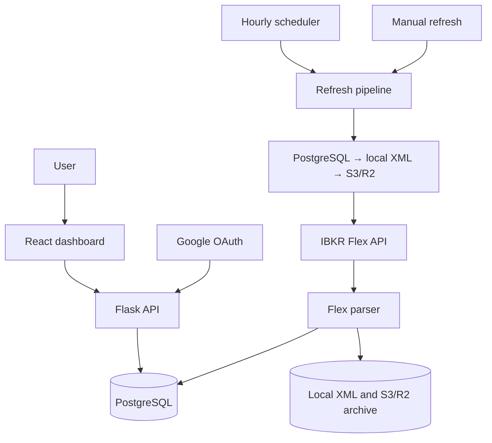

# Product specification — IBKR Portfolio Viz

## Purpose

IBKR Portfolio Viz turns each user's latest Interactive Brokers Flex statement into a private dashboard for daily portfolio visibility, signed exposure analysis and ticker-level target allocation.

## Capabilities

### Access and dashboard

- Google OAuth, server-side sessions, encrypted Flex credentials and `user_id` data isolation provide private access.
- Consolidated and per-account views show NAV, cash, daily P&L, exposures and account metadata.
- Linked charts, sortable holdings, amount masking, responsive layouts and light/dark themes support portfolio analysis.

### Exposure and allocation

- Positive market values are long exposure; negative market values are short exposure. Gross exposure is long plus the absolute short balance, while net exposure is long minus the absolute short balance.
- Cash follows the same signed-position model as every other instrument: positive balances are long cash and negative balances (margin financing) are short cash.
- Long and short books each support ticker allocation, target weights, drift and rebalance estimates. Short-book actions use short/cover terminology.
- Targets are stored per user and account view. Largest-remainder rounding produces displayed weights totalling 100.0%.

### Refresh

- `fetch_and_store` serves credential tests, asynchronous manual refresh jobs and the hourly scheduler.
- Refreshes check PostgreSQL, local XML and canonical S3/R2 storage in sequence, then request IBKR Flex data.
- Parsed reports update PostgreSQL, local cache and canonical report-date archives.
- User-facing refresh completion does not wait for canonical archival; the archive worker uses bounded object-store timeouts and does not overwrite an existing report-date object.
- Market-timezone scheduling, expanding refresh intervals and per-user serialization coordinate updates.

## Flex data contract

The parser expects one or more `FlexStatement` elements containing:

| Flex section | Stored or displayed data |
| --- | --- |
| `AccountInformation` | Alias, account type, SYEP/DRIP state, tax-lot method, open date |
| `EquitySummaryInBase` | Current and previous NAV, stock/options values, accruals, and a signed cash position |
| `MTMPerformanceSummaryInBase` | Authoritative account total and every non-zero named instrument's daily P&L contribution, including fully closed intraday trades |
| `OpenPositions` | Position value, quantity, cost/P&L data, asset and option metadata |

The report date comes from each statement's `toDate`. Current dashboard totals use the latest stored position date and account summary rows.

## Architecture

Flask serves the React bundle and API, APScheduler runs hourly refreshes, and PostgreSQL stores users, sessions, accounts, positions, daily P&L contributions, targets and fetch history.
