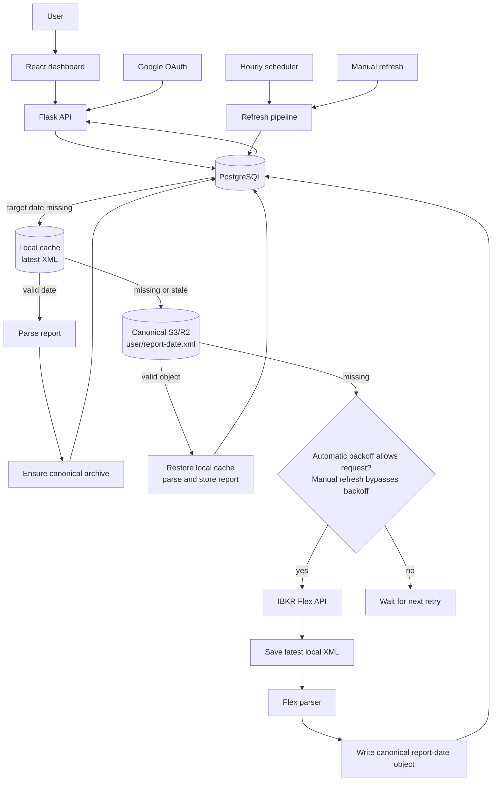

# Product specification — IBKR Portfolio Viz

## Purpose

IBKR Portfolio Viz turns each user's latest Interactive Brokers Flex statement into a private portfolio dashboard. It focuses on daily portfolio visibility and ticker-level target allocation; it does not place orders or provide live brokerage data.

## Users

- Individual IBKR investors with stock, ETF, option or other Flex-reported positions.
- Multi-account holders who need consolidated and per-account views.
- Investors who maintain target weights and periodically rebalance securities.

## Implemented behavior

### Identity and setup

- Google OAuth authenticates users; a signed cookie references a server-side session record.
- Each user supplies a Flex Web Service token and Query ID. The token is encrypted with Fernet before storage.
- Connection testing stores the credentials, invokes the fetch pipeline synchronously and returns the available report date and detected accounts.
- Authentication and portfolio records are scoped by `user_id`; private API responses disable caching.

### Portfolio dashboard

- Users can select all accounts or an individual account, with aliases, account type and net liquidation shown in the selector.
- The summary displays report date, net liquidation, daily return/P&L, securities market value and cash balance.
- A diverging bar chart attributes daily P&L to each non-cash position.
- A ticker donut links hover state with desktop holdings rows; mobile uses a card list.
- Holdings can be sorted by symbol, market value, daily P&L or daily percentage move. Option symbols are compacted for display.
- Amount masking, responsive layout and light/dark themes are supported.

### Allocation and rebalancing

- Allocation is ticker-level and uses positive invested securities value as its denominator.
- Cash and margin balances remain in portfolio totals but do not participate in the holdings chart, allocation weights, targets or trade suggestions.
- Displayed weights use largest-remainder rounding so the visible values total exactly 100.0%.
- Targets are saved per user and selected account view. Saving is allowed only when every value is non-negative and the total is 100.0%.
- Drift is current weight minus target weight, rounded to one decimal point. Suggested buy/sell amounts apply that drift to total invested securities value; no share quantities or orders are generated.

### Refresh and recovery

- `fetch_and_store` is the only IBKR-calling path. Credential tests, manual refreshes and the hourly scheduler use it.
- A fetch is skipped when PostgreSQL already contains the expected report date. Otherwise both automatic and manual attempts validate the report date inside the latest local XML, then check the expected-date canonical S3/R2 object, before reaching IBKR.
- A valid cache hit is parsed and retried through the PostgreSQL transaction. A local hit is restored to canonical S3/R2; a canonical hit restores the local cache. This makes database retry failures recoverable without another IBKR request.
- Successful IBKR XML is saved to the user's latest local cache. After parsing, one canonical object is archived under the actual report date before the PostgreSQL transaction begins.
- Automatic retries use exponential 1-hour, 2-hour, 4-hour and 8-hour tiers. On the fourth consecutive failure, the user moves to `error` and automatic scheduling stops. The dashboard Refresh action is rate-limited and may bypass retry backoff, but it never bypasses a valid cached report; a successful manual refresh restores `healthy` status.
- Per-user refresh serialization prevents simultaneous scheduler and dashboard actions in the same web process from issuing duplicate IBKR queries.
- Expected report dates are calculated in the configured market timezone, respect `report_ready_hour`, and roll weekends back to Friday.
- Repeated transient failures move a user to `error`. Only known credential or query errors move a user to `needs_attention`; an explicit manual credential test can recover the state.

## Flex data contract

The parser expects one or more `FlexStatement` elements containing:

| Flex section | Stored or displayed data |
| --- | --- |
| `AccountInformation` | Alias, account type, SYEP/DRIP state, tax-lot method, open date |
| `EquitySummaryInBase` | Current and previous NAV, stock/options values, cash and accruals |
| `MTMPerformanceSummaryInBase` | Account and per-position daily P&L, previous close data |
| `OpenPositions` | Position value, quantity, cost/P&L data, asset and option metadata |

The report date comes from each statement's `toDate`, not the network fetch time. Current dashboard totals use the latest stored position date and the latest account summary rows.

## Data and system architecture

The refresh pipeline is shared by automatic and manual triggers. Its cache wall checks PostgreSQL, local XML and canonical S3/R2 in that order; IBKR is called only when none contains the expected report. The PostgreSQL schema contains six tables: `users`, `sessions`, `accounts`, `positions`, `targets` and `fetch_log`. The Flask process also runs the APScheduler hourly job and serves the production React bundle.

## Current limitations

- Data is statement-based and normally reflects the previous business day; it is not real time.
- The UI formats monetary values as USD even though position currency is retained.
- Allocation targets are ticker-level securities percentages only; cash targets, asset-class targets and order-ready quantities are not supported.
- S3 archival is optional and best effort. Without S3, recovery is limited to PostgreSQL and the configured latest-XML cache directory.
- The application has an admin users endpoint but no admin UI.
