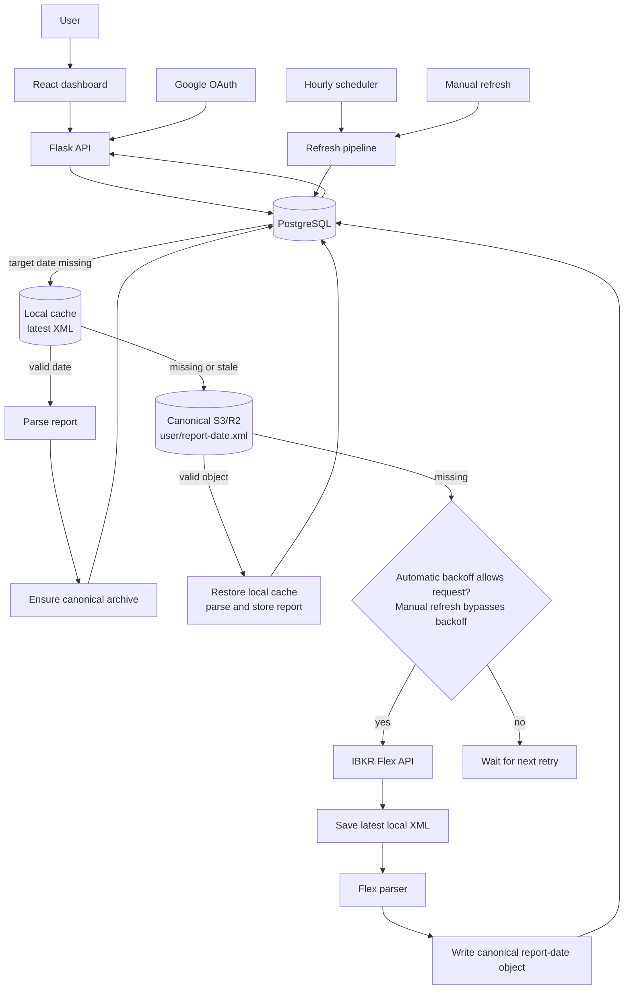

# IBKR Portfolio Viz

A private, multi-user dashboard for Interactive Brokers Flex reports. Users sign in with Google, connect their own Flex Query, inspect portfolio performance and maintain per-account target allocations.

## Quick start

Prerequisites: Python 3.12+, Node.js 20+, PostgreSQL and Google OAuth web-app credentials.

```bash
python3 -m venv venv
source venv/bin/activate
pip install -r requirements.txt

psql -d <dbname> -f backend/schema.sql
cp config.example.yaml config.local.yaml
# Fill in the required values described below.

cd frontend
npm ci
npm run build
cd ..

python backend/app.py
```

Open `http://localhost:5123`, sign in, then enter an IBKR Flex Web Service token and Query ID. The configured Flex Query must include the sections and attributes consumed by [`backend/flex_parser.py`](../backend/flex_parser.py).

For frontend development, run `npm run dev` from `frontend/`; Vite serves port 5173 and proxies `/api` and `/auth` to Flask on port 5123.

## Configuration

Copy [`config.example.yaml`](../config.example.yaml) to the git-ignored `config.local.yaml`. Every key can also be supplied as a case-insensitive environment variable; environment values override the YAML file.

Required settings:

| Key | Purpose |
| --- | --- |
| `postgres_url` | PostgreSQL connection URL |
| `google_client_id`, `google_client_secret` | Google OAuth 2.0 web-app credentials |
| `base_url` | Public application origin used to build `/auth/callback` |
| `secret_key` | Flask cookie-signing secret |
| `flex_encryption_key` | Fernet key used to encrypt Flex tokens at rest |

S3-compatible storage is optional. Set `s3_bucket` and, when needed, its endpoint, region and credentials to archive raw XML. The remaining refresh, server and admin settings are documented in the example file.

## System architecture and cache wall



`fetch_and_store` is the only path that calls IBKR. It runs during credential testing, manual refreshes and scheduled refreshes. Every automatic or manual attempt validates the date inside the latest local XML and then checks the expected-date canonical object before contacting IBKR. Scheduled attempts use exponential retry backoff; an explicitly rate-limited manual refresh bypasses scheduler backoff, but does not bypass a valid cached report. Per-user in-process locking also prevents a manual and scheduled attempt from issuing duplicate requests concurrently.

The cache wall always checks PostgreSQL first, then the latest local XML, then the canonical object for the expected report date. Only a complete miss can reach IBKR. There is one canonical object per user and actual report date: local XML is the fast first recovery layer, while canonical storage provides durable recovery across restarts.

Automatic retries use 1-hour, 2-hour, 4-hour and 8-hour backoff tiers. The fourth consecutive failure changes the user to `error` and removes them from automatic scheduling. A rate-limited manual refresh may still recover the account; a successful refresh resets the status to `healthy`.

IBKR report readiness and expected business dates use `market_timezone` and `report_ready_hour`. The scheduler checks eligible users hourly and processes them concurrently. Production App Service deployments must enable Always On while the scheduler runs inside the web process.

## Data model

| Table | Purpose |
| --- | --- |
| `users` | Google identity, encrypted Flex configuration and refresh state |
| `sessions` | Server-side session validation records |
| `accounts` | Latest per-account NAV components and account metadata |
| `positions` | User/account/report-date position snapshots |
| `targets` | Per-user, per-account ticker target weights |
| `fetch_log` | Refresh success and error history |

All application queries scope portfolio data by `user_id`. Private API and auth responses are marked `no-store`.

## Deployment and maintenance

Pushes to `main` build the React app and deploy the backend, frontend bundle and Python requirements to the configured Azure Web App. Pull requests run the frontend build, Python compilation, shell syntax checks and the configured Copilot review gate.

## Stack

React 18, TypeScript, Tailwind CSS 4, ECharts 5, Flask, APScheduler, gunicorn, PostgreSQL, optional S3-compatible object storage and Fernet encryption.

## Features

- Private multi-account dashboard with Google OAuth, encrypted per-user Flex credentials and strict data isolation.
- Consolidated or per-account NAV, cash, daily P&L and linked ticker holdings views, with responsive themes and amount masking.
- Securities-only target allocation, drift and buy/sell estimates, backed by scheduled refresh and DB/S3/local recovery. Cash is excluded from allocation and rebalancing.

## Product behavior

See [`PRD_IBKR_Viz.md`](PRD_IBKR_Viz.md) for the implementation-aligned product specification and current limitations.

## License

MIT
