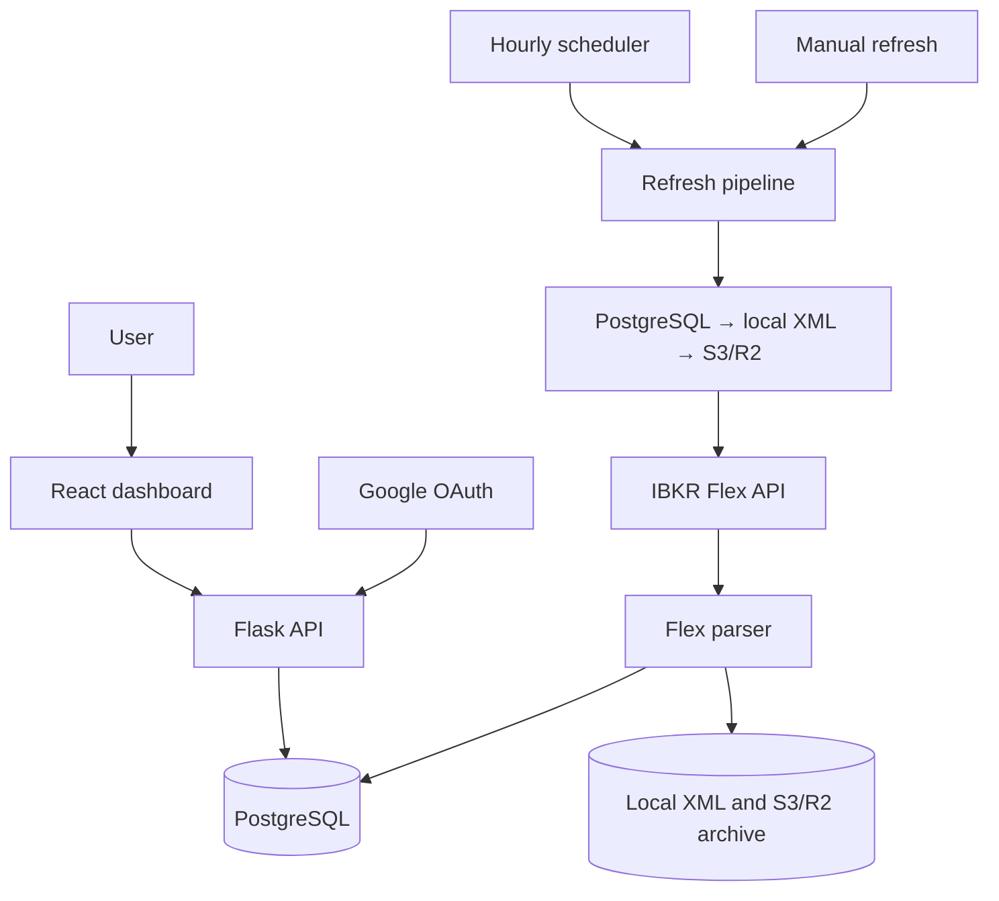

# IBKR Portfolio Viz

A private, multi-user dashboard for Interactive Brokers Flex reports. Users sign in with Google, connect their own Flex Query, inspect portfolio performance and maintain per-account target allocations.

## Quick start

Runtime: Python 3.12+, Node.js 20+, PostgreSQL and Google OAuth web-app credentials.

```bash
python3 -m venv venv
source venv/bin/activate
pip install -r requirements.txt

psql -d <dbname> -f backend/schema.sql
cp config.example.yaml config.local.yaml
# Add the configuration values described below.

cd frontend
npm ci
npm run build
cd ..

python backend/app.py
```

Open `http://localhost:5123`, sign in, then enter an IBKR Flex Web Service token and Query ID. The configured Flex Query supplies the sections and attributes consumed by [`backend/flex_parser.py`](../backend/flex_parser.py).

For frontend development, run `npm run dev` from `frontend/`; Vite serves port 5173 and proxies `/api` and `/auth` to Flask on port 5123.

## Configuration

Copy [`config.example.yaml`](../config.example.yaml) to the local configuration file `config.local.yaml`. Every key can also be supplied as a case-insensitive environment variable; environment values override the YAML file.

Core settings:

| Key | Purpose |
| --- | --- |
| `postgres_url` | PostgreSQL connection URL |
| `google_client_id`, `google_client_secret` | Google OAuth 2.0 web-app credentials |
| `base_url` | Public application origin used to build `/auth/callback` |
| `secret_key` | Flask cookie-signing secret |
| `flex_encryption_key` | Fernet key used to encrypt Flex tokens at rest |

`s3_bucket`, endpoint, region and credentials configure raw XML archives. The example file documents refresh, server and admin settings.

## System architecture and cache wall



`fetch_and_store` serves credential tests, asynchronous manual refresh jobs and scheduled refreshes. It checks PostgreSQL, local XML and S3/R2, parses Flex data and stores report snapshots. Canonical XML archival runs after the database commit in a bounded background operation and skips objects already present. Market-timezone scheduling and per-user locking coordinate hourly updates.

## Data model

| Table | Purpose |
| --- | --- |
| `users` | Google identity, encrypted Flex configuration and refresh state |
| `sessions` | Server-side session validation records |
| `accounts` | Latest per-account NAV components and account metadata |
| `positions` | User/account/report-date position snapshots |
| `daily_pnl_contributions` | Non-zero named daily MTM contributions, including fully closed intraday trades |
| `targets` | Per-user, per-account ticker target weights |
| `fetch_log` | Refresh history |

All application queries scope portfolio data by `user_id`. Private API and auth responses apply privacy-focused cache controls.

## Deployment and stack

Pushes to `main` build the React app and deploy the backend, frontend bundle and Python requirements to the configured Azure Web App. Pull requests run the frontend build, Python compilation, shell syntax checks and the configured Copilot review gate.

Run the `daily-pnl-contributions` release task once with this release to create
its table and backfill existing snapshots from the canonical raw XML archive.
The dashboard retains its previous position-based view as a rolling-deploy
fallback until the task completes.

React 18, TypeScript, Tailwind CSS 4, ECharts 5, Flask, APScheduler, gunicorn, PostgreSQL, S3-compatible object storage and Fernet encryption.

See [`PRD_IBKR_Viz.md`](PRD_IBKR_Viz.md) for product behavior.

## License

MIT
